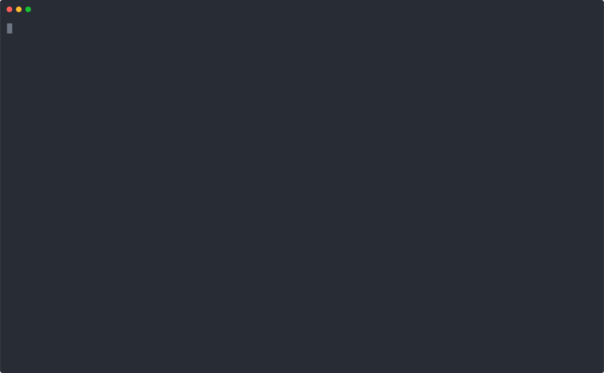

## ☁️  Cfnctl

<p align="center">
  <a href="https://goreportcard.com/report/github.com/rogerwelin/cfnctl"></a>
  <a href="https://github.com/rogerwelin/cfnctl/actions/workflows/ci.yml"></a>
  <a href="https://github.com/rogerwelin/cfnctl/blob/master/go.mod"></a>
  <a href="https://github.com/rogerwelin/cfnctl/releases"></a>
  <a href="https://github.com/rogerwelin/cfnctl/blob/master/LICENSE"></a>
</p>

[[ _pronounced_ cfn control _or_ cloudformation control ]]

Are you a fan of Terraform but forced to use Cloudformation due to organizational or technical reasons? Introducing **cfnctl**, a CLI that brings the Terraform cli experience to Cloudformation. You'll never need to use the AWS Console for managing stacks again!

With *cfnctl*, you write Cloudformation templates as usual but use the cli workflow that you are already used to from Terraform, including:

* **apply**
* **plan**
* **destroy**
* **output**


### Demo

[](https://asciinema.org/a/abFfMrlLp3MTDHjrrzWpbyDDI?autoplay=1)


### Installation

Grab a pre-built binary from the [GitHub Releases page](https://github.com/rogerwelin/cfnctl/releases) for your OS of choice


### Usage

If you are a terraform user the *cfnctl* cli works as you would expect. Running the binary without flags will give you the help output:

```bash
✗ ./cfnctl
 NAME:
    cfnctl - ✨ Terraform cli experience for AWS Cloudformation

 COMMANDS:
  apply     Create or update infrastructure
  plan      Show changes required by the current configuration
  destroy   Destroy previously-created infrastructure
  output    Show all exported output values of the selected account and region
  validate  Check whether the configuration is valid
  version   Show the current Cfnctl version
  help, h   Shows a list of commands or help for one command

 GLOBAL OPTIONS:
  --help, -h  show help (default: false)

 Examples
  Apply infrastructure using the "apply" command.
    $ cfnctl apply --template-file mycfntmpl.yaml --auto-approve
```


### Notice

Cfnctl is under early development and is missing several features such as:

* user cancellation does not clean up stacks,  [Issue](https://github.com/rogerwelin/cfnctl/issues/1) 
* does not support uploading large templates to S3 yet, [Issue](https://github.com/rogerwelin/cfnctl/issues/2) 
* does not support drift detection yet, [Issue](https://github.com/rogerwelin/cfnctl/issues/5) 

Feature request and pull requests are welcome. Please see the [Contributing doc](https://github.com/rogerwelin/cfnctl/blob/master/CONTRIBUTING.md)

If you read this far consider hitting the star ⭐


